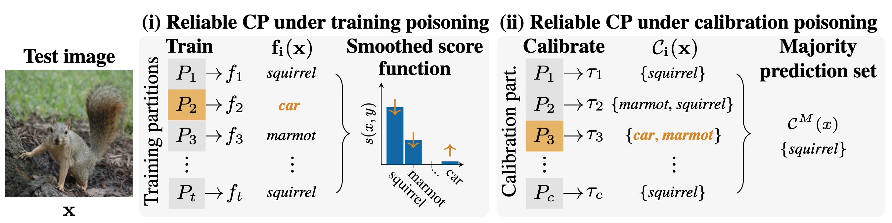

# Provably Reliable Conformal Prediction Sets in the Presence of Data Poisoning



Reference implementation of the reliable conformal prediction sets (RPS) proposed in the paper:

**<a href='https://openreview.net/pdf?id=ofuLWn8DFZ'>Provably Reliable Conformal Prediction Sets in the Presence of Data Poisoning</a>**<br>
*Yan Scholten, Stephan Günnemann*<br>
International Conference on Learning Representations, ICLR 2025 (Spotlight)<br>
[ <a href='https://www.cs.cit.tum.de/daml/reliable-conformal-prediction/'>Project page</a> | <a href='https://openreview.net/pdf?id=ofuLWn8DFZ'>PDF</a> ]

## Demo Notebook Example

We provide a [demo notebook](demo.ipynb) with an example of how to compute reliable conformal prediction sets (RPS) under calibration poisoning, and a [full demo notebook](demo-full.ipynb) to demonstrate RPS under training and calibration poisoning.

## Install

Instructions for dependencies and configurations before running code:
```
python -m venv venv
source venv/bin/activate
pip install -r requirements.txt
pip install -e .
export CUBLAS_WORKSPACE_CONFIG=:4096:8
```
The code was tested with Python 3.11.9, pip 24.0, PyTorch 2.3.1+cu118, and CUDA 11.8 on NVIDIA GeForce GTX 1080 Ti.

## Reproducibility 

To start reproducing the results of our paper systematically on a compute cluster, please setup [SEML](https://github.com/TUM-DAML/seml) and make sure that the data folder has the following structure:
```
data/
├── certificates/
├── datasets/
└── models/
```

**1. Training**:

Execute the following to train models (which will be stored in `data/models/`):

```
seml rcp_training add configs/training/0-ResNet18-CIFAR10.yaml 
seml rcp_training start
```

**2. Calibration and certification**:

After model training has completed, compute the reliable prediction sets and certificates (which will be stored in `data/certificates/`):
```
seml rcp add configs/rcp/0-cert-setting0.yaml
seml rcp start
```

To reproduce the full results of our paper, first train the required models using the provided [training configurations](configs/training) and then compute the reliable prediction sets and certificates using the provided [RCP configurations](configs/rcp).

## Cite
Please cite our paper if you use this code in your own work:

```
@inproceedings{scholten2025provably,
    title={Provably Reliable Conformal Prediction Sets in the Presence of Data Poisoning},
    author={Yan Scholten and Stephan G{\"u}nnemann},
    booktitle={The Thirteenth International Conference on Learning Representations},
    year={2025},
    url={https://openreview.net/forum?id=ofuLWn8DFZ}
}
```

## Contact

For questions and feedback please contact:

Yan Scholten, Technical University of Munich<br>
Stephan Günnemann, Technical University of Munich

## License

The code by Yan Scholten and Stephan Günnemann is licensed under MIT license.
